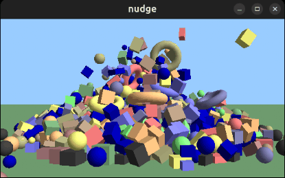
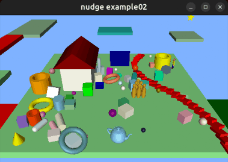

# Nudge Physics Library

## Introduction

Nudge is a small data-oriented and SIMD-optimized 3D rigid body physics library created by Rasmus Barringer in 2017 ([GitHub](https://github.com/rasmusbarr/nudge)).

This 2024 version ([GitHub](https://github.com/Flix01/nudge/tree/master)) is just an **attempt** to ease user experience, by embedding part of the original demo code into the library itself, and extending some of its functionalities.

> **Note:** Most of the physics-related stuff has been kept intact, so the new version does not improve stuff in this area.
> **Note:** The original version is available in the [original_version](https://github.com/Flix01/nudge/tree/master/original_version) sudfolder of this repository too.

## Features
- Single file `nudge.h`
- Only box and sphere colliders (i.e. collision shapes) supported (but every body can be a compound of colliders)
- Max number of colliders: 8192
- Static, kinematic and dynamic bodies
- Collision groups and collision masks
- Kinematic animation support
- Doxygen documentation

## Screenshots

<b>example/main.cpp:</b>



<b>example/example02.cpp:</b> 



Both examples require the glut library (or freeglut)

## Building
- Being a header-only library, all that is required is to define **NUDGE_IMPLEMENTATION** in a .cpp file before including _"nudge.h"_
- The library works only with SIMD enabled: the recommended requirements are **AVX2** and **FMA**; the minimum requirement is just **SSE2**. In many cases adding something like _--march=native_ in the compiler options is enough (in g++/clang++ syntax): _-march=haswell_ is probably better for independent builds.
- **note** Running a SIMD-compiled program on hardware where SIMD is not supported is likely to cause RANDOM CRASHES.
- **note** When using **emscripten**, _-msimd128_ must be added to the other command-line (simd) options (please read  [HERE](https://emscripten.org/docs/porting/simd.html)). However not all browsers support SIMD by default (without activating it someway): that's one of the main reasons of random crashes inside browsers.
- **note** The [SIMDE](https://github.com/simd-everywhere/simde) library can be used to compile and run nudge replacing or removing SIMD support. One way to remove SIMD (through SIMDE) is to replace the SIMD compilation options with (g++/clang syntax): _-DUSE_SIMDE -DSIMDE_NO_NATIVE_ (optionally with: _-DSIMDE_ENABLE_OPENMP -fopenmp-simd_) [TODO: check if this still works] (of course we should expect a performance penalty without SIMD support).
- The library documentation (recommended) can be generated with the **doxygen** command launched from the same folder as the _Doxyfile_ file
 
## Usage

### Getting Started
<details>
<summary>Here is a code snippet to get started with the library (users can easily extend it using the TODO sections)</summary>

```cpp
// file example01.cpp (in the ./example folder)
// g++ example01.cpp -I../ -I./ -march=native -O3 -Wall -o example01
// or using emscripten, with output in a subfolder named ./html :
// em++ -O3 -msse2 -msimd128 -fno-rtti -fno-exceptions -o html/nudge_example01.html ./example01.cpp -I"./" -I"../"

#define NUDGE_IMPLEMENTATION // [TODO 0] better do this in another cpp file to speed up recompilations
#include "nudge.h"

int main() {
    using namespace nudge;

    // Display helpful info
    show_info();

    // Initialize the context
    context_t c = {}; // reset it
    init_context(&c);

    // Add bodies
    Transform T = identity_transform; T.position[1] = 40.f;
    unsigned body = add_sphere(&c, 1.f, 0.5f, &T); // returns the 'permanent' index to the physic body

    // Program main loop
    while (1) {
        double elapsed_time_from_previous_frame_in_seconds = 1.0f / 60.f; // [TODO 1] get the seconds elapsed from the previous (graphic) frame here somehow

        // Update simulation
        const unsigned substeps = pre_simulation_step(&c, elapsed_time_from_previous_frame_in_seconds);   // mandatory call (substeps are the number of physic frames that are going to be performed in simulation_step(...))
        if (substeps > 0) {
            // here you can move manually kinematic bodies for example, using nudge::TransformAssignToBody(...)
        }
        simulation_step(&c);  // mandatory call (main function of the library)

        // Read back bodies
        for (unsigned body = 0; body < c.bodies.count; body++) {
            const Transform* T = &c.bodies.transforms[body];
            printf("[physic frame: %llu] [body:%u] pos: {%1.3f,%1.3f,%1.3f}\n", c.simulation_params.num_frames, body, T->position[0], T->position[1], T->position[2]);

            // or just draw the body using a smoothed 16-float column-major matrix:
            // float mMatrix[16]; calculate_graphic_transform_for_body(&c, body, mMatrix);
            // [TODO 2] place the code to draw 'body' at model matrix 'mMatrix' here
        }

        if (c.simulation_params.num_frames > 120) break; // [TODO 3] break the loop when user presses ESC somehow
    }

    // Free the context
    destroy_context(&c);

    printf("Exiting...\n"); fflush(stdout);

    return 0;
}
```
</details>

## FAQ
<details>
<summary><b>The sample application is crashing. Why?</b></summary>

&nbsp;
Most likely, your CPU doesn't support AVX2 and/or FMA. The project files are set to compile with AVX2 and FMA support and you need to disable it in build settings.
- **Xcode:** Set "Enable Additional Vector Extensions" to your supported level. Remove `-mfma` and `-mno-fma4` from "Other C Flags".
- **Visual Studio:** Set "Enable Enhanced Instruction Set" under code generation to your supported level. Remove `__FMA__` from the preprocessor definitions.

</details>

<details>
<summary><b>How can I add other colliders (i.e. collision shapes), so that I can use height maps, convex and concave meshes, cylinders, capsules, etc.? And how can I add constraints between bodies?</b></summary>

&nbsp;
...I suggest you use another physics library!  
In any case, the new (2024) version was made mainly to ease the nudge API, and to expose properties (like friction) that were hard-coded before.  
Extending the physics-related stuff is not a purpose of this work.

If you have some experience in physics-engine programming, maybe you could try extending the original version: it allows some extension possibility even in the example code (without touching `nudge.h` at all)!  
Also, it might be helpful to read this (old) [link](https://rasmusbarr.github.io/blog/dod-physics.html) from the original author.

</details>

<details>
<summary><b>How do collision masks work?</b></summary>

&nbsp;
Well, the way collision groups and masks are implemented is very efficient, but a bit difficult to understand, because it allows incoherent conditions.
Every body belongs to a single collision group, and owns a collision mask of all the groups the body should collide with. An example of incoherent condition if the following:
```cpp
// c nudge context ptr
unsigned a,b;  // set these to 2 body indices
// we could have used 'body_set_collision_group_and_mask(...)' here:
c->bodies.filters[a].collision_group = nudge::COLLISION_GROUP_A;c->bodies.filters[a].collision_mask = nudge::COLLISION_GROUP_ALL&(~nudge::COLLISION_GROUP_B);
c->bodies.filters[b].collision_group = nudge::COLLISION_GROUP_B;c->bodies.filters[b].collision_mask = nudge::COLLISION_GROUP_ALL;
// => a doesn't want to collide with b, but b wants to collide with a
```
How incoherent conditions are handled depends on the optional definition **NUDGE_COLLISION_MASKS_CONSISTENT** (undefined by default, can be defined before the NUDGE_IMPLEMENTATION definition).
By default, in the code above, a and b do not collide. Please note that by always using coherent conditions, collision behavior should not depend on the NUDGE_COLLISION_MASKS_CONSISTENT definition at all.

</details>

## LICENSE

MIT license

