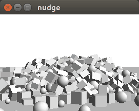
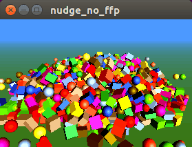
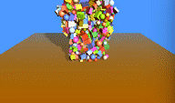

# EXAMPLE

In this folder are present:

<b>main.cpp:</b>

<b>main_no_ffp.cpp:</b> 

<b>main_no_ffp_with_shadows.cpp:</b> 

## HOW TO COMPILE

### main.cpp

This is the default stand-alone demo of the nudge upstream repository.
It can be compiled using the makefiles available in the three subfolders: linux, mac and win.

### main_no_fpp.cpp

This is a port of the default demo that does not use the fixed function pipeline (so that it can be compiled using emscripten).
It uses teapot.h from https://github.com/Flix01/fbtBlend-Header-Only.

Compilation instructions are at the top of the file.

### main_no_fpp_with_shadows.cpp

This is an enhanced version of main.no_ffp.cpp with shadows, more objects and dynamic resolution (the resolution of the window and of the shadow map can decrease when the frame rate is low).
It uses teapot.h and dynamic_resolution.h from https://github.com/Flix01/fbtBlend-Header-Only.

Compilation instructions are at the top of the file.

**PREREQUISITES**

* glut (or freeglut)
* glew (Windows only)

